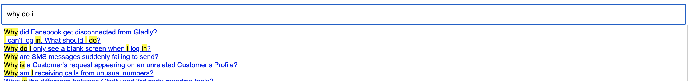

# Background

This repository contains code examples for utilizing Gladly APIs to build your own Help Center

This repository should be used as a tool for **learning** and not as production code!

# Tip: Use the Gladly Embed Code

You don't have to build your own Help Center! You could simply embed the Gladly Help Center embed code on a page on your website to get FAQs set up in a matter of minutes. Click [here](https://help.gladly.com/docs/help-center-configuration?highlight=help%20center#embed-the-help-center-code) to view instructions on how to do this!

# What This Code Does

- A user on Gladly can still use the Answers and Help Center layout functionality to manage the Help Center layout and Answers content
- This code will then retrieve the Help Center layout information from Gladly and show that as a table of contents on the left-hand side of the page
- When a user clicks on an answer on the left-hand side table of contents, the code then utilizes Gladly's APIs to retrieve answer contents and then shows it on the right-hand side of the page
- When a user types in the search bar, the code utilizes Gladly's APIs to search for answers that could potentially match the user's query and displays search results in a container beneath the input bar

## Important Caveats

- Unlike the default out-of-the-box Gladly embed code, this code does not optimize for any SEO capabilities
- Unlike the default out-of-the-box Gladly embed code, the CSS in this demo is not responsive on mobile devices

# Setup

Open up `index.html` in your favorite code editor

1. Set `HELP_CENTER_ID` to your Help Center ID. You can get this value from the Settings > Help Center page in Gladly, then clicking on the 3 dots next to the Help Center and clicking on Embed. The Help Center ID is the value in `brandId`
2. Set `ORG_ID` to your Organization ID. You can get this value from the [GET Organization](https://developer.gladly.com/rest/#operation/getOrganization) API
3. Set `ORG_URL` to your organization URL. This is the **domain part only** of the `gladlyUrl` value in the [GET Organization](https://developer.gladly.com/rest/#operation/getOrganization) API response body. For example, if `gladlyUrl` here is set to `https://gladly.us-1.gladly.com`, the `ORG_URL` should be `gladly.us-1.gladly.com`

# How It's Built

1. First, the code retrieves the help center layout JSON (format: `https://cdn.gladly.com/orgs/configs/help-center/${HELP_CENTER_ID}.json`)
2. Next, it stores the language and audience ID of this help center in 2 variables: `language` and `audienceId`. Note that `audienceId` isn't always set for a help center - but language always will be
3. Next, it calls the `answer-titles` public REST API to retrieve answer titles associated with this help center `https://${ORG_URL}/api/v1/orgs/${ORG_ID}/help-center/${HELP_CENTER_ID}/answer-titles?lng=${language}&audienceId=${audience}`
4. It then organizes the answer sections into the left-hand side of the page
5. When a user clicks on an answer title on the left-hand side of the page, the code calls the [find answer API](https://developer.gladly.com/rest/#operation/getAnswer) `https://${ORG_URL}/api/v1/orgs/${ORG_ID}/answers/${answerId}?lng=${language}` and puts the `bodyHtml` into the answer container on the right-hand side
6. When a user types in the search box, the code calls the [search answer API](https://developer.gladly.com/rest/#operation/searchAnswers) `https://${ORG_URL}/api/v1/orgs/${ORG_ID}/answers/search?q=${encodeURIComponent(searchQuery)}&audienceId=${audienceId}&lng=${language}` and then displays search results
7. When a user clicks on an answer in the search box, the code will retrieve the answer using the [find answer API](https://developer.gladly.com/rest/#operation/getAnswer) `https://${ORG_URL}/api/v1/orgs/${ORG_ID}/answers/${answerId}?lng=${language}` and puts the `bodyHtml` into the answer container on the right-hand side
